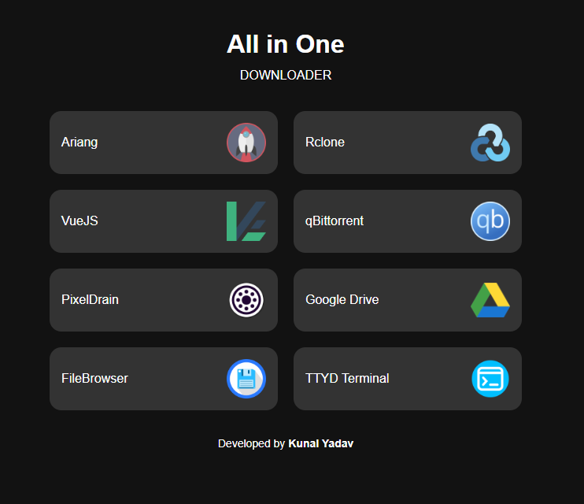

# All-in-One Downloader  

**All-in-One Downloader** is a Docker-based solution that combines multiple downloading and file management tools into a single container. With **Caddy** as a reverse proxy, all services are accessible through a single exposed port, making setup and access simple and efficient.  

## Features  

- **Homepage (`/`)** – A dashboard listing all available tools for easy navigation.  
- **AriaNG (`/app/aria`)** – A modern web-based frontend for Aria2, supporting HTTP, FTP, and BitTorrent downloads.  
- **qBittorrent (`/app/qbit`)** – A feature-rich BitTorrent client with a web interface.  
- **File Browser (`/app/files`)** – A lightweight file manager accessible via the web.  
- **ttyd (`/app/ttyd`)** – A web-based terminal for accessing the container’s shell.  
- **Rclone WebUI (`/app/rclone`)** – A graphical interface for managing and syncing cloud storage.  

## Prerequisites  

Ensure you have the following installed:  

- [Docker](https://www.docker.com/get-started)  
- [Docker Compose](https://docs.docker.com/compose/install/)  

## Configuration  

### 1. Rclone Setup (Important!)  
- Modify `config/rclone.conf` to add your **Rclone remote storage configuration**.  
- **Do not change the remote name** – it must remain **Google:**  
  > ⚠ **Warning:** Changing the remote name from `Google:` will break the upload functionality.  

### 2. Environment Variables  
Modify the `docker-compose.yml` file to configure:  
- **PORT** – The single port exposed by Caddy for all services.  
- **GLOBAL_PASSWORD** – A password to secure access.  

## Installation & Usage  

### 1. Build the Docker Image  
```sh
docker build -t aio-downloader .
```

### 2. Start the Container  
```sh
docker compose up -d
```

## Accessing the Applications  

Once the container is running, access the services via a browser:  

| Service | URL |
|---------|-----|
| **Homepage (Dashboard)** | `http://<your-server-ip>:<PORT>/` |
| **Rclone WebUI** | `http://<your-server-ip>:<PORT>/app/rclone` |
| **AriaNG** | `http://<your-server-ip>:<PORT>/app/aria` |
| **File Browser** | `http://<your-server-ip>:<PORT>/app/files` |
| **qBittorrent** | `http://<your-server-ip>:<PORT>/app/qbit` |
| **ttyd (Terminal)** | `http://<your-server-ip>:<PORT>/app/ttyd` |

Replace `<your-server-ip>` with your actual server address and `<PORT>` with the value set in `docker-compose.yml`.  

## Security  

- **Single Authentication:** The `GLOBAL_PASSWORD` environment variable secures all services behind a single login.  
- **Only One Exposed Port:** Thanks to **Caddy**, all applications are accessible through a single port.  

## Contributing  

Contributions are welcome! If you find any issues or have suggestions, open an issue or submit a pull request on the [GitHub repository](https://github.com/av1-is-better/All-in-One-Downloader).  

## License  

This project is licensed under the [MIT License](LICENSE).  